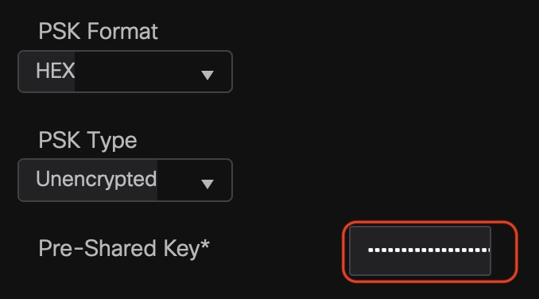

# Cisco AireOS WLC config decryption tool

This tool allows to simplify migration process from Cisco AireOS WLC to the new Cisco Catalyst 9800 IOS-XE based.

The results of "Cisco TAC Tool - WLC Config Converter" https://cway.cisco.com/wlc-config-converter/ won't contain
any passwords or RADIUS/TACACS+/PSK keys. The Cisco's recommended way is to enter all those information manually for
security reasons and this make sense. But in real life you can come across many reasons why you might need to recover
some passwords or do migration to the new WLC without knowing ASCII PSK.

The idea and AES key was taken from this article:

Obtaining Passwords from Cisco Wireless LAN Controllers (Ryansecurity, 16.05.2014)
https://herrymorison.tistory.com/entry/Obtaining-Passwords-from-Cisco-Wireless-LAN-Controllers

The PSK hex from the tool output can be added manually to then new configuration file, CLI or via WebGUI:

```
wlan <WLAN profile name> <WLAN ID> <SSID>
 security wpa psk set-key hex 0 <PSK in hex format 64 byte>
 ```



## Installation

```
pip install pycryptodome
```

## Usage

```
python3 Cisco_WLC_decrypt_config.py <wlc_config_filename>
```
